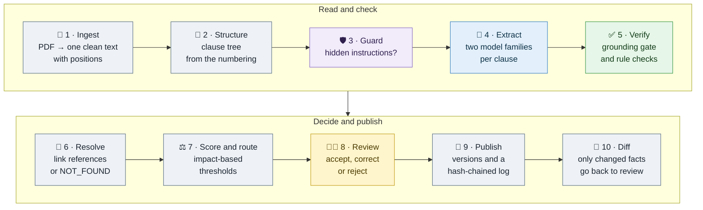
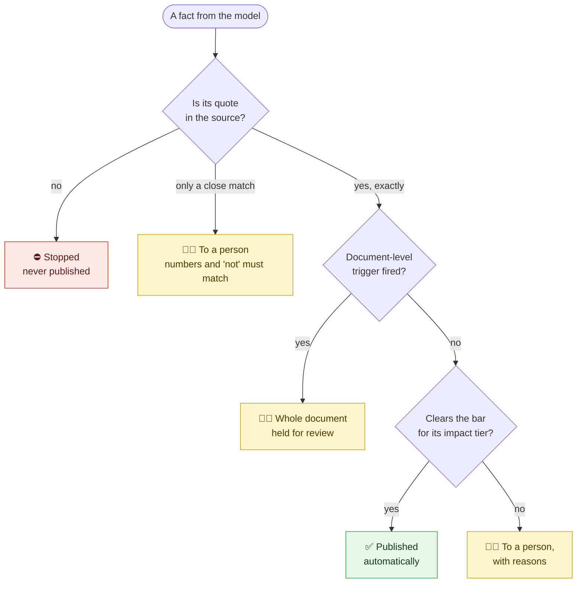

<div align="center">

# 🔎 RegExtract

### Regulatory facts you can trust

**Every fact with its evidence, a score and a review decision.**<br/>
*AI models read the text. Our code decides what is published.*

[](https://www.python.org/)
[](https://github.com/langchain-ai/langgraph)
[](https://docs.pydantic.dev/)
[](https://github.com/BerriAI/litellm)
[](#-quick-start)
[](#-offline-first-live-when-you-want)
[](LICENSE)

[Quick start](#-quick-start) · [How it works](#-how-it-works) · [Measured, not claimed](#-measured-not-claimed) · [Runbook](RUNBOOK.md)

</div>

---

RegExtract turns a regulatory PDF into a **clause tree** and **structured facts**: obligations (who must do what, how strongly, under what condition), entities (dates, limits, organisations, standards…) and cross-references. Compliance systems act on these facts, so a wrong fact is costly. That is why the whole design is built around one rule:

> **We check the evidence. We never ask the model for it.**
> The model gives a quote. Our code finds that quote in the source and takes the page and character position from where *it* found it. If the quote is not there, the fact is never published, however confident the model was.

> [!NOTE]
> **All data in this repository is synthetic.** `data/sample/SAMPLE-01.pdf` is a made-up regulation from the fictional *Examplia Standards Authority*. The original evaluation document and its labelled data are not included, and the tests that need them skip themselves. See [Synthetic data](#-synthetic-data).

## ✨ Why it's different

| 🧾 Evidence is checked, not requested | 🤝 Two model families, not one | 🚨 Failures are loud |
|---|---|---|
| Every quote is found in the source: exact first, then without spaces, then a close match. A close match must keep the same numbers and the same "not", and it always goes to a person. | Two models from different companies read every clause. Their agreement is a signal, and facts only the second model finds go to review, so **misses become visible too**. | A failed model call is reported as a failure, never as "no facts". One unanswered clause holds the whole document. A guard that cannot check a clause does not pass it. |

| 🎯 People where the risk is | 🔗 No wrong links | 📜 Nothing changes quietly |
|---|---|---|
| The bar for automatic publishing rises with the harm a mistake can cause. Every fact sent to a person carries its reasons. | References to other laws are linked with hybrid search, a reranker, a score floor and a number check ("Law No. 24" is not "No. 28"), otherwise **NOT_FOUND**. | Facts have versions, every publication goes into a hash-chained log, and the record shows which model *actually* answered. |

## 🚀 Quick start

```bash
git clone https://github.com/nishantrv/RegExtract.git && cd RegExtract
pip install -r requirements.txt

python run.py doctor        # what is installed, and the current settings
python run.py extract --pdf data/sample/SAMPLE-01.pdf --issuer ESA --jurisdiction EX   # run the pipeline
python run.py redteam --pdf data/sample/SAMPLE-01.pdf --issuer ESA --jurisdiction EX   # attack the guard step
python -m pytest -q         # 54 pass; 60 skip because they need the original document
```

**No API key. No cost.** Results land in `outputs/`: the clause tree, every fact with its evidence and decision, the review queue (most urgent first), the hash-chained publish log and a run manifest.

`python run.py evaluate …` also runs the evaluation harness. Its nine failure-class checks were written for the original document, so on the synthetic sample most of them report FAIL. That is expected: they look for clauses that SAMPLE-01 does not have.

## 🧭 How it works

Ten steps. Only step 4 needs an AI model. Everything else is normal code with unit tests.



<sub>🟦 AI model · 🟩 gate · 🟪 guard · 🟨 person · ⬜ code. Reviewer corrections become test data (the gold set), and a new revision starts again at step 1.</sub>

### What happens to one fact



| Impact | Facts | Published automatically only if |
|---|---|---|
| 🔴 High | dates, time periods, money and number limits, and obligations about validity, enforcement, exemptions or scope | score ≥ 0.90 **and** both models agree **and** every rule check passes |
| 🟠 Medium | other obligations, cross-references, references to laws and standards, product categories | score ≥ 0.80 |
| 🟢 Low | organisations, individuals, roles, locations | score ≥ 0.75 |

<sub>These are starting values. In production they are set from a gold set and the review team's capacity.</sub>

**Document-level triggers** (numbering gaps, more than about 5% of quotes not found, a clause the model never answered) override every fact score.

## 📊 Measured, not claimed

**Offline:** measured on a real 8-page regulation (not included here), with the rule-based stand-in instead of a model. These numbers test the checks, not the models.

| Check | Result |
|---|---|
| Facts whose quote is found in the source | **153 of 153** |
| Planted fake facts stopped by the grounding gate | **18 of 18**, and the whole document held for review |
| Quotes with a changed number or a dropped "not" | refused |
| Failure classes | **9 of 9** pass |
| Reference linking | **8 of 8** correct, **0** wrong links |

**Live:** one run with free-tier Mistral and Groq models and Jina search.

| Check | Result |
|---|---|
| Real model calls | **146**, producing **353** facts |
| Unsupported quotes stopped | **18** |
| Possible misses surfaced by the second model | **77**, all sent to review |
| Weak facts published automatically | **0**: the document was held, the safe result |
| Provenance | caught the provider answering with a **different model** from the one requested |
| Guard red team | **6 of 7** attacks caught |
| Cost | **about $0.02** |

The live run also found three real bugs, and each one is fixed: the judge's reply budget, a reply format some models use, and loading API keys from `.env`.

## 🧰 Tech stack

| | Tool | Why it is here |
|---|---|---|
| 🕸️ Orchestration | **LangGraph** | Named steps with typed state. `interrupt()` pauses the run for a person, and it resumes from a SQLite checkpoint, even in another process |
| 📐 Output contract | **pydantic v2** | Defined once: the schema the model fills, the check on every reply, the pipeline's data, and what downstream receives |
| 🧱 Structured output | **Instructor** | Every reply is validated; an invalid one is sent back with the error |
| 🔀 Model access | **LiteLLM Router** | Named routes (primary, second, guardrail, judge), so changing a provider is a configuration change |
| 📄 PDF | **pdfplumber** | Character-level positions, so the published offsets are real |
| 🎯 Grounding gate | **rapidfuzz** | Fast close matching that also says *where* it matched |
| 🔗 Reference linking | **BM25 + vectors, rank fusion, reranker** | Optional Qdrant backend and Jina reranker; the same fusion runs in process without them |

<details>
<summary><b>Where the stack is deliberately <i>not</i> used</b></summary>

- **Search is not part of extraction.** The document is already in hand. Embeddings do two jobs only: linking references to documents already held, and matching clauses across revisions.
- **Standard codes are not matched by similarity.** "IEC 60335-1" and "IEC 60335-2-13" sit close together as vectors and are different standards, so identifiers use exact rules.
- **The AI judge never decides anything.** It only orders the review queue. It cannot publish, reject or override the grounding gate.
- **No LangChain.** LangGraph orchestrates and LiteLLM calls the models, so it would have nothing to do.
- **No table engine.** A table is read as one clause, and its relationships come from the linear text, so there is only one extraction path.
- **Considered, not built:** a prompt promotion gate (the offline stub ignores prompts, so `run.py evaluate` failing on a regression is the gate for now), trace export (the run manifest already records timing, counts, models and cost) and a critic agent (two model families already give the second opinion).

</details>

## 🔌 Offline first, live when you want

Offline is the default. If a recorded reply (a **cassette**) exists for a call, it is replayed exactly. If not, a rule-based stub produces format-valid, genuinely grounded facts. Stub output is labelled `source: stub`, and the evaluation report refuses to present stub numbers as model quality.

To use real models:

```bash
cp .env.example .env    # fill in the keys you have; .env is ignored by git
python run.py extract --pdf data/sample/SAMPLE-01.pdf --issuer ESA --jurisdiction EX --live --record
```

`--record` saves every reply as a cassette, so the next offline run replays real model output. The default routes are Claude Opus 5 (primary) and GPT-4.1 (second family), with gpt-oss models on Groq for the fallback, the guard and the judge. Any LiteLLM model name works. `.env.example` lists every setting.

<details>
<summary><b>Every step in detail</b></summary>

| Step | What it does | Model? |
|---|---|---|
| **ingest** | PDF to one clean text with character offsets. Strips repeating headers and footers, reads document metadata from them, repairs text-layer artefacts | no |
| **segment** | Builds the clause tree from the numbering | no |
| **guardrails** | A pattern scanner that always runs, and an optional policy classifier, check document text for injection before it enters a prompt | classifier only, optional |
| **extract** | One structured call per clause, with parent headings and definitions as context; twice, with two model families, if agreement is on | yes |
| **verify** | Finds every quote in the source, runs the rule checks, compares the two runs. A failed call is flagged, never read as "no facts" | no |
| **resolve** | Links external references to documents already in the corpus, or says NOT_FOUND | no (embeddings) |
| **document_flags** | Document-level problems that override fact-level scores | no |
| **route** | Combines the signals, applies impact-based thresholds, writes reasons | no |
| **judge** | Orders the review queue; never decides what is in it | yes, optional |
| **human_review** | In review mode, pauses the run for a person and resumes with their decisions | no |
| **publish** | Versioned output, the review queue, and a hash-chained log entry per publication | no |
| **diff** | Compares two revisions clause by clause, matches renumbered clauses, emits a changed-obligations event | no |

</details>

<details>
<summary><b>Trust, risk by risk</b></summary>

| Risk | What stops it |
|---|---|
| A fact the source does not support | The grounding gate. We find the quote; the model never supplies a location |
| A model call that fails or is cut off | Fails closed: the clause is flagged `extraction_failed`, the document is held, and the clause heads the review queue |
| A reply that does not fit the contract | Validated against the pydantic contract and sent back with the error. Still invalid is an error, not an answer |
| One model agreeing with itself | The second run is a different model family; a fallback in the primary's family is dropped |
| A provider quietly swapping models | Provenance records the model that actually answered; the manifest counts fallbacks |
| Instructions hidden in document text | A pattern scanner plus a policy classifier. A clause either one flags is reviewed, and the classifier fails closed |
| A wrong link to another regulation | Hybrid search, a reranker, a score floor and a number check; otherwise NOT_FOUND |
| A published fact changing quietly | Corrections create new versions, and every publication is in a hash-chained log that `run.py verify-log` checks |

</details>

<details>
<summary><b>What a run writes to <code>outputs/</code></b></summary>

```
clauses.json        the clause tree: ids, headings, text, page and character ranges
extractions.json    every fact, with evidence, rule checks, score and decision, and a link on each external reference
review_queue.csv    what a person still has to look at, most urgent first, with reasons
publish_log.jsonl   append-only, hash-chained record of every publication and reviewer decision
run_manifest.json   every step: timing, counts, cost, the models that answered, settings, flags
eval_report.md      failure classes, precision and recall, reference linking   (run.py evaluate)
redteam_report.md   what the guard step caught and missed                      (run.py redteam)
```

</details>

## 🗂️ Project layout

```
regextract/
├── config.py · contract.py · normalize.py   settings · the output contract · quote matching
├── pipeline/       the LangGraph run: pause and resume, checkpoints, run manifest
├── document/       ① ingest   ② structure
├── guardrails/     ③ guard
├── extraction/     ④ extract, and the prompts
├── llm/            model access: gateway, routes, cassettes, offline stub
├── verification/   ⑤ grounding gate, rule checks, document flags
├── resolution/     ⑥ reference linking
├── routing/        ⑦ score and route, and the judge
├── review/         ⑧ reviewer decisions
├── publishing/     ⑨ publish and the hash-chained log   ⑩ diff
└── evaluation/     evaluation harness and guard red team
data/               synthetic corpus catalogue and distractor titles
data/sample/        SAMPLE-01, a synthetic regulation (PDF and HTML)
gold/               synthetic hand-labelled cases
tests/              114 tests (54 run on the synthetic data)
run.py              the command-line tool
RUNBOOK.md          how to run and check every part, step by step
```

## 🧪 Synthetic data

Everything under `data/` and `gold/` is made up for this repository (see [`data/sample/README.md`](data/sample/README.md)):

| File | What it holds |
|---|---|
| `data/sample/SAMPLE-01.pdf` / `.html` | a short synthetic regulation from the fictional Examplia Standards Authority |
| `data/corpus_catalog.json` | 5 documents: the 2 that SAMPLE-01 cites and 3 labelled near-misses |
| `data/distractor_titles.txt` | 160 unrelated titles, mixed in as noise for reference linking |
| `gold/section_5.json` | 7 hand-labelled facts (6 entities, 1 cross-reference) |
| `gold/resolution.json` | 5 reference-linking cases, some with NOT_FOUND as the right answer |

<details>
<summary><b>Using your own documents and labels</b></summary>

Do not overwrite the tracked synthetic files. Keep your own data in `private/`, which git ignores, and point the settings at it (in `.env` or the shell):

```bash
REGEXTRACT_CATALOG=private/corpus_catalog.json
REGEXTRACT_DISTRACTORS=private/distractor_titles.txt
GOLD_DIR=private/gold
python run.py extract --pdf private/your-document.pdf --issuer <ISSUER> --jurisdiction <CODE>
```

</details>

<details>
<summary><b>Limitations, stated plainly</b></summary>

- **The gold set is small.** Enough to show the harness computes precision and recall correctly, not enough for a quality claim, and the report says so.
- **The routing thresholds are starting values,** not derived from data. The code shows the mechanism that would set them: precision per confidence band, per type, on a real gold set.
- **English text PDFs only.** HTML and scanned pages fit the same design but are not built. OCR would change the close-match thresholds, so it is not a drop-in.
- **Change detection is tested on synthesised revisions,** because only one revision of the original document was available.
- **Offline numbers are stub numbers.** Run `--live` for model quality.
- **The publish log is tamper-evident, not tamper-proof.** Proof needs write-once storage underneath it.
- **Review has no screen.** Decisions are a JSON file: enough to show the loop, not what an analyst should use every day.

</details>

## 🙏 Credits

The code, tests and documents were written with help from Claude Code (Anthropic).

<div align="center"><sub>Apache 2.0 · Built to show that AI extraction can be checked, not just trusted.</sub></div>
